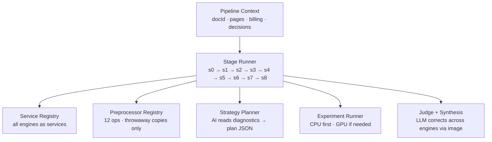
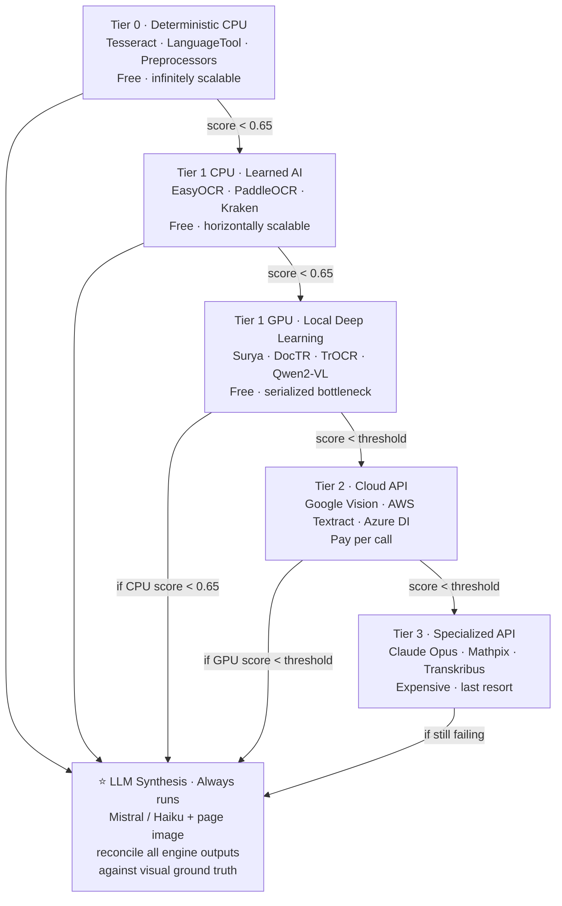
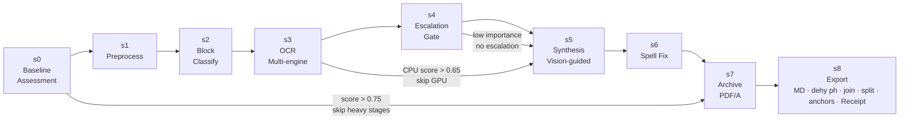
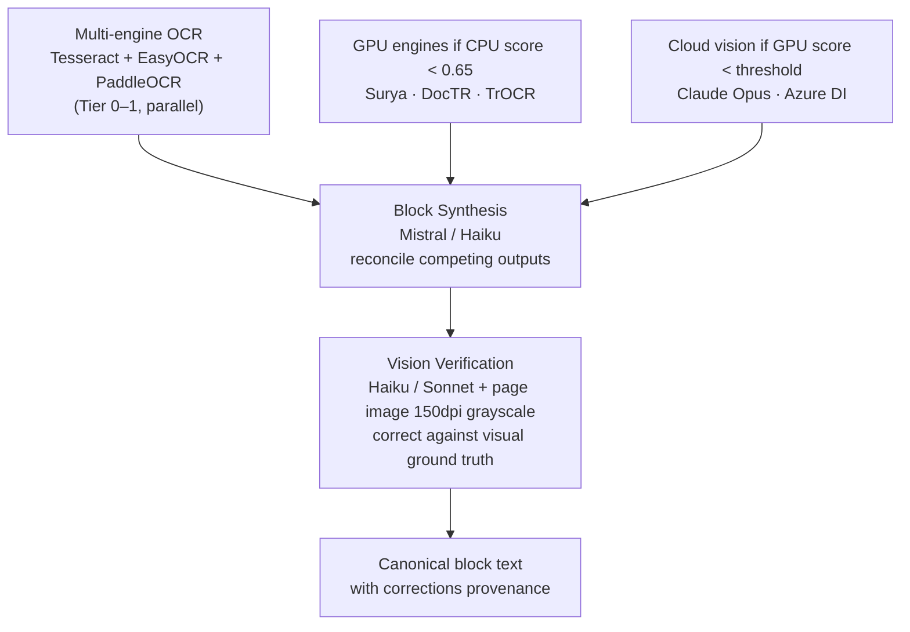
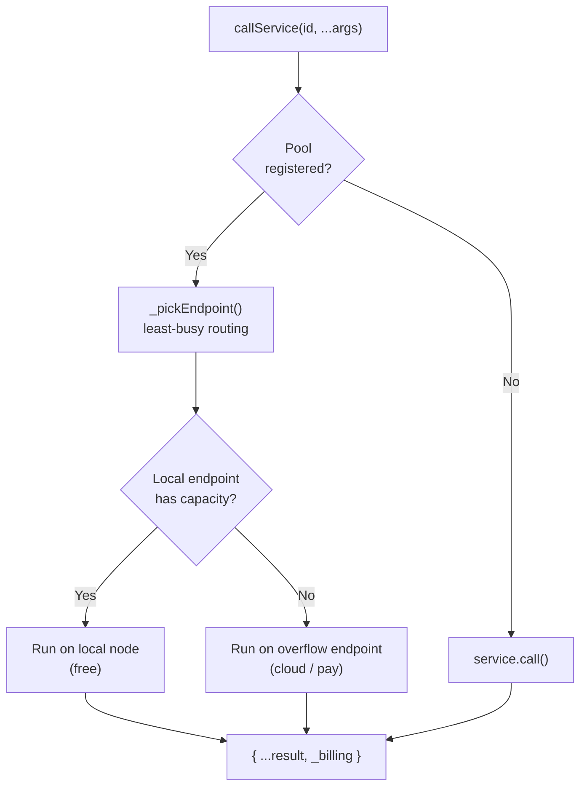
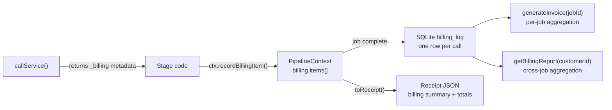

# Searchability Pipeline: Architecture and Strategy

## The Forensic Analyst Model

The central insight behind this pipeline is that OCR is not a single operation — it is an **investigation**. A skilled forensic analyst does not apply one technique to every piece of evidence. They examine the specimen first, form a hypothesis about what happened to it, select a targeted battery of tests, run experiments in parallel where time and resources allow, compare competing results, and synthesize a final judgment with full provenance of every step taken.

This pipeline applies that same methodology to image PDFs.

Every document is treated as a unique artifact with its own challenges: degraded scan quality, mixed scripts, handwriting, tabular content, noise from archival photography, rotated or skewed pages, bleed-through from the reverse side of the sheet. No single OCR engine handles all of these well, and no fixed preprocessing recipe improves all of them. What works on a clean printed Arabic text will damage a newspaper column. What sharpens a faded Victorian typeface will destroy a Persian manuscript's calligraphic strokes.

So the pipeline **strategizes per document, per page, and even per block**. An AI strategy planner reads the output of cheap diagnostic operations — skew angle, contrast histogram, script detection, word confidence distribution, page archetype — and produces a strategy object: which CPU-based preprocessors to run (in throwaway copies only), which OCR engines to run in parallel, whether to invoke GPU-accelerated engines, and when to escalate to expensive cloud vision models. The strategy is not a fixed recipe. It is a reasoned plan tailored to what the planner observed.

After the CPU tier runs its experiments, a judge scores each branch. If the best CPU result exceeds a quality threshold, GPU branches are skipped entirely — GPU time is the scarcest resource in the system and is reserved for cases where cheaper engines genuinely failed. If synthesis is warranted (always, for difficult scripts), a lightweight LLM corrects discrepancies across engine outputs by comparing them against the page image as visual ground truth. It does not pick one engine's output — it synthesizes: if all engines render `VVhy n0t?` but the image clearly shows `Why not?`, the synthesis model corrects to `Why not?`. The result has better accuracy than any individual engine alone.

Every decision — why a branch was skipped, which engine won, what corrections were applied, what the quality delta was — is recorded in the context object and serialized into a forensic receipt. This receipt is the audit trail. It answers: what was done, in what order, at what cost, and what quality gain resulted. Over time, cross-document analysis of these receipts feeds strategy improvement: patterns that consistently fail get replaced; patterns that succeed get promoted.

---

## System Architecture



### Compute Tiers

GPU is a **time bottleneck**, not just a cost. GPU capacity is limited and serialized; CPU tools scale freely across network nodes. The system therefore maximizes parallel CPU experimentation before spending GPU time, and maximizes GPU before spending cloud budget.



---

## Pipeline Stages



### s0 — Baseline Assessment
Reads existing PDF quality score from the database. Classifies the document: has text layer or not, baseline composite score, language detected, estimated archetype. Sets thresholds for whether later stages are worth running. If the document is already above `goodDoc` threshold (0.75), skips expensive stages.

### s1 — Preprocessing
Runs policy-selected image preprocessing on throwaway copies of each page. Since these are scratch copies only for OCR input, preprocessing can be **extreme**: aggressive denoising, hard binarization, contrast normalization, background removal, deskew. Operations that would damage an archival image are fine here because the original is never touched.

**Image preparation for vision models**: before any page image is sent to a vision LLM, it is normalized to grayscale at 150 DPI. Empirical testing shows 150 DPI consistently produces the best recognition results — it is not merely a cost optimization. Lower DPI loses critical detail in small fonts and degraded print; higher DPI has not shown recognition improvement for typical archival text sizes. Because source documents are usually higher resolution and being downscaled, there is meaningful room to experiment with grayscale bit depth (8-bit standard vs. higher contrast curves) and with sharpening applied post-downscale, since downscaling introduces subtle blurring that a sharpening pass can partially recover. Color information is discarded: vision models derive no OCR benefit from it, and it inflates input size with no return.

Preprocessors (all in `preprocess_server.py`, exposed over HTTP):
- `deskew` — Hough line angle correction
- `despeckle` — morphological noise removal
- `adaptive_threshold` — Gaussian adaptive binarization (cv2)
- `normalize_contrast` — CLAHE histogram equalization
- `denoise_nlmeans` — Non-local means denoising
- `sharpen` — Unsharp mask
- `binarize_sauvola` — Local threshold binarization for uneven lighting
- `remove_background` — Background elimination
- `invert` — Dark-background inversion
- `upscale_2x` — 2× bicubic upscaling for small-text pages
- `extreme_binarize` — Otsu global binarization (most aggressive)
- `aggressive_denoise` — fastNlMeansDenoising h=20

### s2 — Block Classification
Segments the page into regions and classifies each: TEXT, TABLE, FIGURE, EQUATION, MARGINALIA, EDGE\_ARTIFACT, STAMP, NOISE, HANDWRITTEN. `block-filter.js` is applied to every region: edge garbage from archival photography (scanner edges, binding shadows, page-edge stamps) is removed before OCR. Only `toOcr` (TEXT + HANDWRITTEN) regions continue to s3; tables, figures, and equations are preserved in `page._filteredBlocks` for later structural handling. The count of skipped garbage blocks is logged to the decision trail.

### s3 — OCR (Multi-engine)

The core OCR stage. It operates in three sequential phases: (1) rasterize each page and run layout detection to find block bounding boxes, then run Tesseract on each block crop in parallel; (2) run all secondary batch engines concurrently over all crops; (3) synthesize corrections via Haiku keyed correction and assemble final per-page words.

**Block-level hyphen repair and trailing spaces**: immediately after hOCR parsing, `repairHyphens()` joins line-break hyphens (`deter-` + `mined` → `determined`) and appends a trailing space to every word. This ensures assembled text is naturally tokenised for search — no word runs at line boundaries — and that the synthesis model receives clean input rather than hyphenated fragments.

**Layout detection** — finds column bounding boxes so OCR can be applied per-block rather than on the full page. The cascade below fires each step only when the previous step found zero usable blocks:

1. **Standard enhancements at 150 DPI** — Tesseract `--psm 1` is run on the raw 150 DPI layout image and on four enhanced variants: `raw`, `otsu_threshold`, `sharpen`, `otsu+sharpen`, `autocontrast`. Each is scored by the number of usable blocks Tesseract returns, not by overall image quality. The winner is whichever variant yields the most blocks. `bleed_suppression` is explicitly excluded: visual analysis showed that MedianFilter-based bleed suppression fills column gutters with mid-gray posterization noise, destroying the whitespace signal that Tesseract's RLSA algorithm needs to detect column boundaries. Sharpen corrects blur introduced by downscaling from 300 DPI to 150 DPI.

2. **Multi-DPI search** — gated on `ctx._scanIssues` (scanned image PDFs only; text PDFs skip this step). Tries rasterizing at 100 DPI and 200 DPI, running the same enhancement suite at each. Different DPIs reveal different column structure because downsampling artifacts vary — a scan that yields zero blocks at 150 DPI may yield two columns at 100 DPI.

3. **Vision-guided preprocessing** — fires when all standard methods yield zero blocks and an API key is configured (scanned PDFs only). Sends a 400 px thumbnail to Haiku and asks two questions in one call: which preprocessing methods would best reveal column whitespace, and what language does the text appear to be. The same image answers both questions without an extra round-trip. Haiku returns `{"methods":["otsu","sharpen"],"lang":"fra"}`. Cost is approximately $0.0002 per page. Language reported here may differ from document metadata — a French-catalogued journal may turn out to be Arabic — and is recorded as a candidate, not an override (see Language candidate accumulation below).

4. **Geometric projection-profile fallback** — sums pixel brightness per x-column of the layout image, identifies whitespace valleys as column gutters. Works on any scan, including handwritten manuscripts and heavily degraded material where Tesseract finds no blocks at all.

**Language candidate accumulation** — languages are collected throughout the pipeline as `page._langCandidates = [{lang, source}]`. Discovery sources: metadata (from document properties or s2 classification), and s3 vision (from the layout thumbnail consult). Candidates are only appended — never overridden — and are recorded in discovery order. Tesseract is then run once per candidate on each block; the run with the highest `cleanRatio` wins that block. The winning lang is recorded on each word object. This handles multi-language documents where the title page is English, the body is Arabic, and the endnotes are Persian. `ctx.meta.langCandidates` records the full discovery chain for analytics.

**Batch OCR engines** — EasyOCR, PaddleOCR, docTR, and Kraken each run as a single Python process over all crops at once, amortizing model load across the entire document rather than paying it per crop. All four run concurrently via `Promise.all`. Surya runs separately as a chunked CLI call (GPU memory limit: 20 crops per chunk). None of these engines are the primary OCR result — all outputs feed the keyed correction synthesis step below as context.

**Keyed correction synthesis** — this is the critical architectural choice. Tesseract words are the spatial anchor: their `bbox` positions are preserved throughout. All other engine outputs are context only. Haiku receives: (1) a numbered Tesseract word list with `*` marking low-confidence words (below `fuzzyT`), (2) raw text from each other engine for the same crop. Haiku returns only a correction JSON — `{"3":"corrected","7":"joined","8":null}` — omitting unchanged words. Maximum output is 200 tokens. This is far cheaper than asking for full corrected text (~word count tokens) and produces far less hallucination risk. Corrections are merged back into the Tesseract word list in-place, preserving all bboxes. When a word is `null` (deleted because it was joined into the previous word), the previous word's `x2` bbox is extended to cover the deleted word's `x2` — but only when both words share the same line (y-centers within 0.75 line-heights). This guard prevents spurious bbox extension when a hyphenated pair wraps across lines.

**CPU-tier engines** (Tier 0–1 CPU):
- `tesseract` — Primary baseline and spatial anchor. Fastest, 100+ languages. Numbered word dict → correction target.
- `easyocr` — Good Arabic/CJK. Python batch script, runs in ocr-venv.
- `paddleocr` — Strong multilingual. Good RTL. Python batch script, runs in ocr-venv.
- `kraken` — Historical document specialist. Good degraded print. Python batch script, runs in ocr-venv.
- `doctr` — Deep learning OCR. Python batch script, runs in ocr-venv.
- `languagetool` — Post-OCR grammar/spell check (Tier 0, deterministic).

**GPU-tier engines** (Tier 1 GPU, local GPU node or pool):
- `surya` — Layout-aware multilingual OCR. Strong Arabic, Indic, CJK. Chunked CLI, 20 crops per call.
- `trocr` — Microsoft TrOCR. Modes: handwritten (trocr-large-handwritten) and printed. `trocr_server.py`.
- `qwen2vl` — Qwen2.5-VL 7B via Ollama. Multimodal, strong on structured content.

**Cloud-tier engines** (Tier 2–3, pay per call):
- `google_vision` — Google Cloud Vision API (Tier 2).
- `azure_di` — Azure Document Intelligence (Tier 2). Structure-aware.
- `aws_textract` — AWS Textract (Tier 2).
- `mathpix` — Equation and math OCR specialist (Tier 3).
- `transkribus` — Handwritten text recognition specialist (Tier 3).
- `claude_vision` — Claude Opus multimodal (Tier 3, highest quality escalation).
- `docling` — IBM Docling: full-document conversion with layout, tables, reading order. `docling_server.py`.
- `nougat` — Meta Nougat: scientific PDF LaTeX reconstruction. `nougat_server.py` (status unknown: transformers was downgraded to 4.57.6 for Surya compatibility — retest before use).

**Debugging: stopAfter and debug mode**

- `config.stopAfter: 's3'` — skips all pipeline stages after s3, enabling per-stage testing without running the full pipeline.
- `config.debug: true` — saves intermediate images next to the source PDF in a `debug/<stem>/` directory:
  - `p{N}_layout_raw.png` — raw unenhanced 150 DPI layout image
  - `p{N}_layout_{winner}.png` — winning enhanced layout variant (omitted when `raw` wins)
  - `p{N}_fullres.png` — full-resolution rasterized page at `rasterDpi`
  - `p{N}_blocks.png` — layout image annotated with detected block rectangles: red for Tesseract-detected blocks, blue for geometrically-detected blocks

### s4 — Escalation
Evaluates whether the current best OCR result is good enough or whether more expensive stages are warranted. Applies budget awareness and importance gating: a trash-importance document does not escalate to Claude Vision; an archival-importance document does if quality is still low after GPU engines ran.

### s5 — Synthesis (Universal, vision-guided correction)

**Synthesis is not an escalation step — it runs after every multi-engine OCR pass, including Tier 0–1.**

This is the highest-leverage step in the pipeline. Running three deterministic engines on a block costs almost nothing and produces three competing text candidates. A lightweight LLM (Mistral locally, or Haiku via API) seeing all three outputs plus the page image as visual ground truth is uniquely positioned to resolve every disagreement: it applies language context, domain knowledge, and visual verification simultaneously. The cost is small; the quality gain is consistent and significant.

The synthesis model receives:
1. The original page image (grayscale, 150 DPI)
2. Tesseract's numbered word dict (primary OCR — the correction target)
3. All secondary engine outputs from the same block (`_altTexts`)

It returns a corrections JSON: `{"3": "corrected_word", "7": "corrected_word"}` or `{"full": "complete transcription"}` when the primary OCR is too garbled to fix word-by-word. The correction model doesn't pick a winner — it synthesizes. If every engine produced `VVhy n0t ?` but the image shows `Why not?` and the document is 20th-century English prose, the model corrects it. The final text is assembled by applying the corrections dict to the numbered word dict and joining.

**Two-stage synthesis** applies when GPU or cloud escalation also ran:
1. **Block synthesis** (Mistral or Haiku): reconcile CPU engine outputs into a corrected candidate — runs universally after every multi-engine OCR block
2. **Vision verification** (Haiku or Sonnet + image): verify and correct the candidate against visual ground truth — always runs; model choice scales with document difficulty (Haiku default, Sonnet for difficulty > 0.7)

For Arabic/Persian, the model outputs only Arabic/Persian Unicode script and never falls back to Latin transliteration.



### s6 — Spell Fix
Post-synthesis language-model spell correction for Latin-script documents. Uses LanguageTool (local, free) for grammar and spelling, with optional Haiku pass for complex corrections.

### s7 — Archive
Generates searchable PDF/A using OCRmyPDF, embedding the synthesized text layer into the original page images. Preserves archival fidelity.

### s8 — Export

Assembles the final markdown document from synthesized block text, then writes it along with the structured JSON receipt and an updated quality score to the database.

**Markdown assembly** involves several non-trivial post-processing steps before the output is usable:

- **Hyphenation removal**: handled at block level in s3 (`repairHyphens()` in `parseHocr`), not at the markdown assembly stage. By the time text reaches s8 it is already dehyphenated and naturally spaced. The s8 pass only needs to handle residual cases where synthesis reintroduced hyphenation or multi-block paragraph joining re-exposed split words.

- **Block joining**: adjacent OCR blocks that belong to the same logical paragraph must be merged. A paragraph broken across a column boundary, a page header interruption, or an OCR segmentation error would otherwise appear as separate short paragraphs in the output. Joining is guided by text-flow signals: capitalization, punctuation endings, spatial proximity, and reading-order metadata.

- **Block splitting**: conversely, a single OCR block may contain multiple logical paragraphs that were run together (common in dense historical typography). These are detected by sentence-boundary analysis and split before assembly.

- **Page anchors**: every block in the assembled markdown carries a page reference attribute so readers can deeplink directly to the corresponding PDF page. Format:

  ```markdown
  Some synthesized paragraph text here.
  {#block-320 data-pn=77}
  ```

  The `id` is a stable block identifier; `data-pn` is the 1-based source PDF page number. Rendering tools can use these anchors to build a two-way link between the markdown document and the original PDF — clicking a paragraph highlights the source page, and page navigation in a PDF viewer can scroll the markdown to the matching block.

---

## Service Registry and Distributed Compute

All engines, preprocessors, synthesis models, and vision services are registered in a **unified service registry** (`service-registry.js`). Every service has:

```js
{
  id: 'surya',
  type: 'ocr',           // ocr | preprocess | synthesis | vision | layout | detect
  cost: { tier: 1, gpu: true, perPage: 0 },
  endpoints: [
    { url: 'local', tier: 'local', maxConcurrent: Infinity },              // local subprocess
    { url: 'http://gpu-node2.local:8081', tier: 'local' },                // second GPU node
    { url: 'https://api.cloud-provider.com/surya', tier: 'overflow', maxConcurrent: 1 }, // cloud fallback
  ],
  call: async (pngPath, lang) => { ... },
}
```



**Pool routing**: when multiple endpoints are registered, `callService()` uses least-busy routing. Local endpoints fill first; overflow endpoints are only used when all local endpoints are saturated. This is the load-balancing model for the local Tailscale cluster.

**Cloud migration path**: when the pipeline moves to cloud, each service becomes a serverless function that auto-scales. The endpoint URL changes; nothing else does.

**Env-var configuration**: endpoint URLs are configured via environment variables so adding a new network node requires no code change:

```bash
SURYA_ENDPOINTS=http://gpu-node1:8081,http://gpu-node2:8081   # pool across GPU nodes
PREPROCESS_ENDPOINTS=http://cpu-node1:8082,http://cpu-node2:8082
LOCAL_LLM=http://llm-host:49800/v1                            # local Ollama endpoint
EASYOCR_OVERFLOW=https://api.cloud-provider.com/easyocr       # cloud overflow
```

### Python OCR Server Protocol

All Python OCR engines are wrapped in `ocr-http-server.py`, a stdlib-only HTTP server deployable on any Tailscale node:

```
GET  /health  → {"status":"ok","engine":"surya"}
POST /ocr     → {engine, image_b64, lang} → {text?, words?}
```

The same server binary handles Surya, EasyOCR, PaddleOCR, Kraken, DocTR, and Tesseract. Deploying a new node is: copy `ocr-http-server.py` + activate `ocr-venv`, run `python3 ocr-http-server.py --engine surya --port 8081`.

A shared Python venv containing all OCR packages is activated on each node running OCR services.

---

## Within-Document Learning

The strategy planner maintains a running history of which engines produced winning results on previous pages of the same document. After 3 consistent page wins by the same configuration, the planner drops losing branches from subsequent pages. This is cheap within-document reinforcement: a 15-page Arabic manuscript that consistently sees EasyOCR beat Tesseract in quality will stop running Tesseract on page 4.

This history is stored on the `PipelineContext` and reset per document. Cross-document learning (which strategies win on which document archetypes) is the job of the analytics layer (`analytics.js`), which mines the receipt database.

---

## Billing and Cost Tracking

Every service invocation — local or cloud — is tracked with actual USD cost plus shadow pricing for local compute. This enables:
- Per-job invoicing for customers
- Per-stage cost/quality optimization analysis
- Planning for cloud migration (know exactly what local compute is costing)

### Shadow pricing defaults (in `config.js`)
| Resource | Rate |
|---|---|
| CPU compute | $0.0005/sec |
| GPU compute | $0.005/sec |
| Local LLM tokens | $0.0002/1K tokens |

### Billing flow



The receipt (`ctx.toReceipt()`) includes a billing summary: item count, total cloud cost, total shadow cost.

---

## Installed Tools and Dependencies

### Node.js pipeline (`src/pipeline/`)
- `better-sqlite3` — SQLite for billing log, quality scores, job queue
- `@anthropic-ai/sdk` — Haiku/Sonnet/Opus for strategy, synthesis, vision
- `ocrmypdf` (CLI) — Archival PDF/A generation with embedded text layer
- `ghostscript` (CLI) — PDF normalization (JPEG2000 compatibility)

### Python OCR venv
| Package | Use |
|---|---|
| `surya-ocr` | Layout-aware multilingual OCR (Arabic, CJK, Indic) |
| `easyocr` | Multi-language OCR, good RTL |
| `paddleocr` | PaddlePaddle OCR, strong multilingual |
| `kraken` | Historical/degraded document OCR |
| `doctr` | Deep learning OCR (TensorFlow/PyTorch) |
| `transformers` | TrOCR (microsoft/trocr-large-handwritten) |
| `docling` | IBM full-document converter with table/layout extraction |
| `nougat-ocr` | Meta Nougat scientific PDF → LaTeX (⚠ broken: needs transformers <5.0) |
| `language-tool-python` | Local grammar/spell checker |
| `olmocr` | Allen AI OLM-OCR (document-level OCR) |
| `opencv-python` | All image processing in preprocess_server.py |
| `scikit-image` | Sauvola binarization, image quality metrics |
| `Pillow` | Image I/O |
| `torch` + `torchvision` | GPU tensor operations |

### Local LLM inference (GPU node via private network)
- **Ollama** — serves local LLMs on a GPU-capable node; endpoint configured via `LOCAL_LLM` env var
  - `qwen2.5vl:7b` — multimodal vision + OCR
  - Additional models as needed

### Key pipeline modules
| File | Purpose |
|---|---|
| `service-registry.js` | Unified registry: all services, pool routing, load balancing |
| `engine-registry.js` | Seeds all OCR + vision + synthesis services into registry |
| `preprocessor-registry.js` | Seeds all 12 image preprocessors |
| `strategy.js` | AI strategy planner: diagnostics → strategy JSON |
| `experiment-runner.js` | CPU branches → GPU if needed → synthesis |
| `judge.js` | Score outputs, decide accept/retry/escalate |
| `block-filter.js` | Classify regions; skip garbage (edge artifacts, stamps, noise) |
| `lang-config.js` | Language → optimal pipeline config map |
| `billing.js` | SQLite billing log, invoice generation, customer reports |
| `context.js` | Document state carrier: pages, quality, decisions, billing |
| `config.js` | All thresholds, model rates, shadow pricing |
| `ocr-server-pool.js` | Persistent Python subprocess management + HTTP dispatch |
| `analytics.js` | Cross-document strategy analysis from receipt database |
| `client.js` | HTTP client for pipeline server |

### Python engine servers (`src/pipeline/engines/`)
| File | Engine |
|---|---|
| `surya_server.py` | Surya OCR (batch_recognition API) |
| `easyocr_server.py` | EasyOCR |
| `paddleocr_server.py` | PaddleOCR |
| `kraken_server.py` | Kraken |
| `doctr_server.py` | DocTR |
| `trocr_server.py` | TrOCR (handwritten + printed modes) |
| `docling_server.py` | Docling document converter |
| `nougat_server.py` | Nougat (broken — transformers 5.x incompatibility) |
| `ocr-http-server.py` | Universal HTTP wrapper (deployable on any Tailscale node) |
| `preprocess_server.py` | 12 image preprocessing operations via OpenCV/skimage |

---

## Registered Services Summary

### OCR engines (type: `ocr`)
`tesseract` (t0), `easyocr` (t1 cpu), `paddleocr` (t1 cpu), `kraken` (t1 cpu), `surya` (t1 gpu), `doctr` (t1 gpu), `trocr` (t1 gpu), `nougat` (t1 gpu, broken), `qwen2vl` (t1 gpu), `google_vision` (t2), `azure_di` (t2), `aws_textract` (t2), `mathpix` (t3), `transkribus` (t3), `claude_vision` (t3), `docling` (t1 cpu)

### Preprocessors (type: `preprocess`, all throwaway-copy only)
`deskew`, `despeckle`, `adaptive_threshold`, `normalize_contrast`, `denoise_nlmeans`, `sharpen`, `binarize_sauvola`, `remove_background`, `invert`, `upscale_2x`, `extreme_binarize`, `aggressive_denoise`

### Synthesis / vision (type: `synthesis` / `vision`)
`haiku_synthesis` (t2 cloud / t1 local GPU node), `languagetool` (t0 local)

---

## Key Implementation Decisions

These records explain *why* specific architectural choices were made in s3 — decisions that look unusual without context.

**1. Enhancement scored by block count, not image quality**

`preprocess_image.py` includes a quality scorer (mean × stddev) that optimizes for overall image clarity. Layout detection has a different objective: column visibility. An otsu-binarized image with pure black text and pure white gutters will score lower on the quality metric than a smoothly-toned grayscale image, but it finds more Tesseract blocks because the column whitespace signal is stronger. For layout detection only, scoring is by block count rather than image quality.

**2. bleed_suppression excluded from layout pass**

MedianFilter-based bleed suppression fills column gutters with mid-gray noise. Tesseract's RLSA (Run Length Smoothing Algorithm) uses whitespace in gutters to detect column boundaries. Filling gutters gives RLSA no signal; the result is zero blocks. `bleed_suppression` is available for OCR crop preprocessing (where it helps with actual text clarity on the crop interior) but is never applied to the layout image used for block detection.

**3. Sharpen after resize**

Downscaling from 300 DPI to 150 DPI introduces Gaussian blur on text edges. Tesseract needs sharp strokes for RLSA to work reliably. UnsharpMask or PIL Sharpen applied post-downscale partially recovers the lost edge contrast. This is why `sharpen` and `otsu+sharpen` are in the layout enhancement set.

**4. Vision asked for both language AND enhancement suggestions in one call**

One API round-trip saves approximately $0.0002 in cost and 300–500 ms of latency. The same thumbnail that reveals which preprocessing methods would help also reveals the document's script and language. Haiku returns `{"methods":["otsu","sharpen"],"lang":"fra"}`. The language field is a bonus — the primary purpose of the call is preprocessing guidance.

**5. Language candidates accumulated, never overridden**

A document's actual language may not match its metadata. A French-catalogued journal may be Arabic. Each discovery source — document metadata, s2 region classification, s3 vision thumbnail consult — adds a candidate to `page._langCandidates`. Tesseract runs once per candidate; the run with the highest `cleanRatio` wins that block. `ctx.meta.langCandidates` records the full discovery chain for analytics and debugging.

**6. Tesseract as spatial anchor for synthesis**

Free-text synthesis — asking Haiku to produce corrected text — loses word-level bounding boxes. These bboxes are needed for the archival PDF text layer (s7 embeds them into OCRmyPDF's hOCR input). Instead, Tesseract provides spatial positions; all other engines provide textual evidence; Haiku corrects specific words by index. Synthesis output is approximately 20 tokens for typical corrections versus approximately word-count tokens for full-text synthesis. Fewer output tokens reduce both cost and hallucination risk.

**7. Null corrections extend bbox on same line**

When Haiku returns `{"5":"nationalité","6":null}` (joining a hyphenated pair like `nationa-` and `lité`), word 6 is deleted but its bbox should be absorbed into word 5 so the archival text layer spans the correct horizontal range. Guard condition: only extend if `|prevCenter_y - currCenter_y| < lineHeight * 0.75`. This prevents spurious bbox extension when a hyphenated pair happens to wrap across lines — in that case prev is on line N and the null word is on line N+1, and absorbing its bbox would be incorrect.

---

## Known Issues and Pending Work

| Issue | Status |
|---|---|
| Nougat status unclear | transformers downgraded to 4.57.6 for Surya — retest nougat before use |
| GOT-OCR2.0 | No installable package; no setup.py/pyproject.toml on GitHub |
| Ollama persistence on GPU node | Runs via manual command; needs systemd service with persistent `HOME`/`OLLAMA_MODELS` paths |
| s2 region geometry | s2-classify still uses stub full-page regions (1700×2200 defaults); needs real page-dimension detection from rasterised PNG |
| s8 hyphenation/joining/splitting | Block joining, block splitting, and page anchor injection are designed but not yet implemented in s8-export |
| Billing only wired in s3 | `recordBillingItem` called after Tesseract in s3; other stages (s5 vision, s6 spell, s7 archive) not yet billing |
| Surya API changed in 0.17+ | `surya_server.py` updated to use `RecognitionPredictor`+`DetectionPredictor`; monitor for further upstream changes |

---

## Design Principles

1. **CPU first, always** — GPU is scarce; maximize deterministic CPU tools before spending GPU or cloud budget.
2. **Synthesis is universal, not an escalation** — LLM synthesis runs after every multi-engine OCR pass at every tier. Even clean Tier 0–1 blocks benefit from a cheap LLM reconciling competing outputs against the page image. This is the highest-leverage step in the pipeline.
3. **Every decision is logged** — for receipt output, within-document learning, and cross-document analytics.
4. **Services, not scripts** — all engines are services in a unified registry; adding an engine is registering one object.
5. **Local first, cloud overflow** — local endpoints fill first; overflow only when saturated; same code works in cloud by changing env vars.
6. **Throwaway copies for preprocessing** — OCR preprocessing can be arbitrarily extreme since originals are never touched.
7. **Block legitimacy first** — page edges, stamps, and noise blocks are filtered before OCR to avoid contaminating quality scores.
8. **Full provenance always** — every stage emits cost, quality delta, and decision rationale into the receipt.
